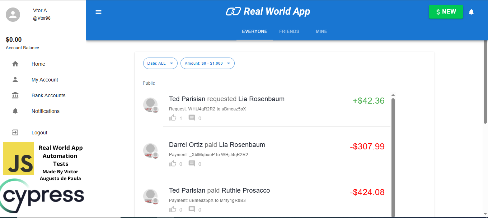

### Cypress RealWorld App 

 

This repository is based on the project developed by (https://github.com/cypress-io/cypress-realworld-app) it contains automated tests implemented with Cypress for the Real World App application. The test suite covers key functionalities, including user login, signup, transaction history, and user menu interactions related to sending money.

Test Cases Covered:

- signUpPage.js: Verifies the user registration process using both valid and invalid data.

- loginPage.js: Tests the login functionality with valid and invalid credentials.

- transactionHistory.js: Validates the transaction history functionality, ensuring that user-initiated transactions are correctly displayed.

- userMenu.js: Tests the money transfer feature through the user menu, including scenarios with both positive and negative amounts.

### Prerequisites 

This project requires [Node.js](https://nodejs.org/en/) to be installed on your machine. Refer to the [.node-version](./.node-version) file for the exact version. 

[Yarn Classic](https://classic.yarnpkg.com/) is also required. Once you have [Node.js](https://nodejs.org/en/) installed, execute the following to install the npm module [yarn](https://www.npmjs.com/package/yarn) (Classic - version 1) globally. 

```shell
npm install yarn@latest -g
``` 

If you have Node.js' experimental [Corepack](https://nodejs.org/dist/latest/docs/api/corepack.html) feature enabled, then you should skip the step `npm install yarn@latest -g` to install Yarn Classic globally. The RWA project is locally configured for `Corepack` to use Yarn Classic (version 1). 

### Yarn Modern

**This project is not compatible with [Yarn Modern](https://yarnpkg.com/) (version 2 and later).** 

### Installation 

To clone the repo to your local system and install dependencies, execute the following commands:

```shell
git clone https://github.com/victoragsto5/rwa
cd rwa
yarn
``` 

### Run the app 

```shell
yarn dev
``` 

### Start Cypress  

```shell
yarn cypress:open
```